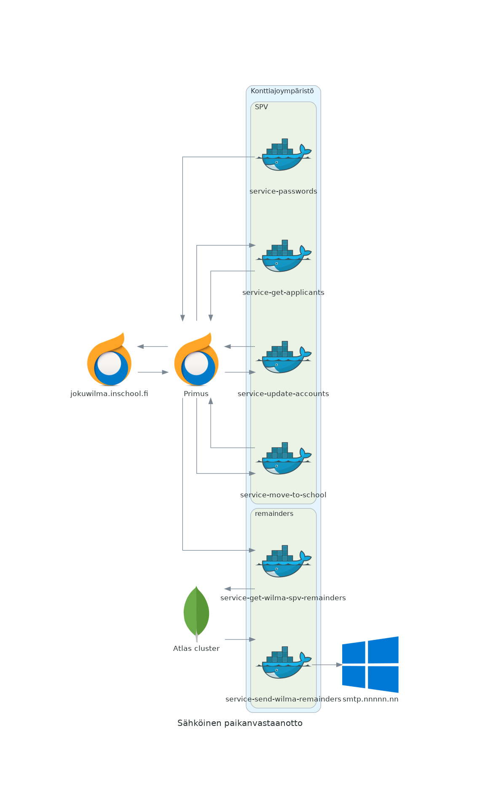

# service-password

Primus opiskelijarekisterin yhteydessä hyödynnettävä mikropalvelu, jonka avulla on mahdollista luoda oletussalasanat hakijoille ja opiskelijoille. Hakijavaiheessa on eri tunnus ja opiskelijarekisteriin siirron yhteydessä luodaan uusi virallinen tunnus jonka aktivointiin käytetään opiskelijarekisterin oletussalasanaa. Siirto opiskelijarekisteriin ja opiskelijan kirjaaminen koskisiirtokelpoiseksi ovat erillisiä mikropalveluita.

Palvelu on alunperin tarkoitettu ajettavaksi konttissa esim. Kubernetes klusterissa ajastettuna. Mikropalvelu on osa laajempaa sähköisen paikanvastaanoton kokonaisuutta.

## Käyttö binäärinä

Kääntäminen

    make compile

    HOST=palvelimen_osoite PORT=NNNN ./bin/service-passwords hakijat # luo oletussalasanan hakija-rekisteriin
---
    HOST=palvelimen_osoite PORT=NNNN ./bin/service-passwords opphenk # luo oletussalasanan opiskelija-rekisteriin

## Primus-tuontimääritykset

main.go

    applicantsImportConfig = "hakija-rekisteri-import"
	studentsImportConfig   = "opiskelija-rekisteri-import"

## Suodattimet hakija- ja opiskelijarekisteriin

config/query.go

    var studentRegistryFilter = ""
    var applicantrsRegistryFilter = ""

## Salaisuudet

config/secrets.go